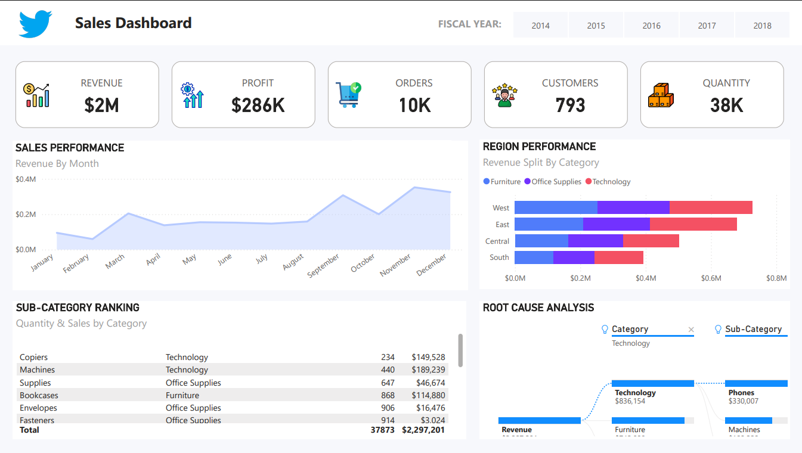

# Mimark Sales Dashboard

## Introduction:

---
This is a power Bi project on sales analysis of an imaginary store called **“Mimark Stores”**. The
project is to analyze and derive insights to answer crucial questions and help the store make
data driven decisions.

**_Disclaimer_**: _All datasets and reports do not represent any company,institution or country, but
just a dummy dataset to demonstrate capabilities of Power BI_

## Skills/ concepts demonstrated:
The following Power Bi features were incorporated-
Bookmarking, quick measures, Page navigation , Power query ,Modelling, filters, tooltips , Button.

## Problem statement:
1. Which category has the highest impact on income in the current year?
2. What is the worth in dollars of the total products available?
3. Which category of goods has the highest sales in each region?
4. Which month was highest and lowest sales made in each year ?

## Visualization :

## Analysis :
 +  Mimark stores currently has a total of 793 customers
 +  A total  of 10k orders were made
 +  38k goods were sold during this period.
 +  The store sold a total of $2M and made a profit of $286k 💰
   ## Conclusion :
   - The goods in the technology category has the highest sales over the years.
   - The highest sales takes place in the November and December.
## Recommendations :
1. Continue focusing on the technology category as it is the highest performing category and capitalize on its popularity by ensuring it is well-stocked and prominently displayed.
2. Leverage the seasonal demand and plan promotional activities and sales events in November and December to maximize sales during these peak months.
3. Analyze the specific products within the technology category that are driving the highest sales and consider expanding the product line or offering bundles to meet customer demand.
4. Explore opportunities to expand the technology category into other store locations or consider opening a dedicated technology-focused store to cater to the growing demand.
5. Monitor sales trends and customer behavior closely to identify any emerging opportunities or potential challenges and adjust strategies accordingly.

   
